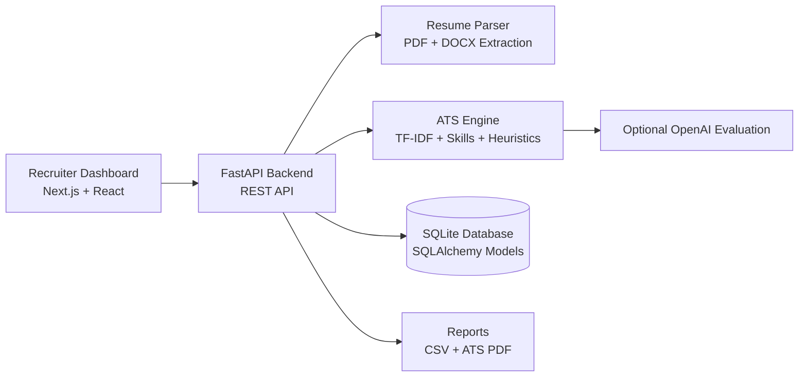

<div align="center">

# AI Resume Screening & ATS Analyzer

### Recruiter-grade AI platform for resume parsing, ATS scoring, candidate ranking, and hiring analytics.


</div>

## Overview

**AI Resume Screening & ATS Analyzer** is a full-stack portfolio-ready SaaS application that helps recruiters upload resumes, compare them with a job description, generate ATS compatibility scores, extract skills, rank candidates, preview resumes, and download professional ATS PDF reports.

The project is intentionally beginner-to-intermediate friendly while still looking and behaving like a real recruiter analytics platform.

## Feature Highlights

- Drag-and-drop PDF/DOCX resume upload
- ATS score out of 100 with transparent breakdown
- Job description matching and missing-skill analysis
- Technical skills, soft skills, and tools/framework extraction
- Candidate ranking with top-candidate highlight
- Data-driven dashboard cards and analytics charts
- PDF resume preview and parsed DOCX preview
- Downloadable ATS candidate report PDF
- CSV export for screening results
- Optional OpenAI-assisted evaluation
- Admin token protection for sensitive workflows
- Persistent dark/light theme
- Vercel, Render, and Railway deployment documentation

## Screenshots

Add final screenshots in `assets/screenshots/` after running the app locally.

| Landing Page | ATS Analysis |
| --- | --- |
| `assets/screenshots/landing-page.png` | `assets/screenshots/ats-analysis.png` |

| Recruiter Dashboard | Resume Ranking |
| --- | --- |
| `assets/screenshots/dashboard.png` | `assets/screenshots/resume-ranking.png` |

## Architecture



### How It Works

1. Recruiter uploads PDF or DOCX resumes from the dashboard.
2. FastAPI validates files, parses text, extracts candidate names, and stores metadata.
3. The job description is analyzed for required skills, preferred skills, experience level, and keywords.
4. The ATS engine calculates score components for skills match, formatting, keywords, experience, and education.
5. Results are ranked, stored, and returned to the dashboard with analytics-ready fields.
6. Recruiters can preview resumes, export CSV results, email shortlisted candidates, and download ATS PDF reports.

Current database: SQLite for simple local development. The service structure can be extended to PostgreSQL or MongoDB for a larger SaaS deployment.

## Tech Stack

| Area | Stack |
| --- | --- |
| Frontend | Next.js, React, TypeScript |
| Styling | Tailwind CSS, responsive glassmorphism UI |
| Charts | Recharts |
| Backend | FastAPI, Python, Pydantic |
| Database | SQLAlchemy + SQLite |
| Resume Parsing | pdfplumber, PyPDF2, python-docx |
| AI/Scoring | TF-IDF, ATS heuristics, optional OpenAI |
| Reports | ReportLab PDF generation, CSV export |
| Deployment | Vercel frontend, Render/Railway backend |

## Local Installation

### Backend

```bash
python3 -m venv .venv
source .venv/bin/activate
pip install -r requirements.txt
cp .env.example .env
python -m backend.utils.generate_sample_files
uvicorn backend.main:app --reload --port 8000
```

Backend URL:

```text
http://localhost:8000
```

### Frontend

```bash
cd frontend
npm install
npm run dev
```

Frontend URL:

```text
http://localhost:3000
```

## Environment Variables

Root `.env`:

```env
APP_NAME="AI Resume Screening & ATS Analyzer"
DATABASE_URL=sqlite:///./data/resume_screening.db
UPLOAD_DIR=data/uploads
CORS_ORIGINS=["http://localhost:3000","http://127.0.0.1:3000"]

OPENAI_API_KEY=
OPENAI_MODEL=gpt-4o-mini
ADMIN_TOKEN=

SMTP_HOST=
SMTP_PORT=587
SMTP_USERNAME=
SMTP_PASSWORD=
EMAIL_FROM=recruiting@example.com
OUTBOX_PATH=data/outbox.log
```

Frontend `.env.local` or Vercel variable:

```env
NEXT_PUBLIC_API_BASE=http://localhost:8000
```

## API Reference

| Method | Endpoint | Purpose |
| --- | --- | --- |
| `GET` | `/health` | Backend health check |
| `POST` | `/upload-resumes` | Upload one or more resumes |
| `POST` | `/analyze` | Run ATS scoring and ranking |
| `GET` | `/results` | Fetch latest screening run |
| `GET` | `/results/export` | Download CSV results |
| `GET` | `/results/{result_id}/report` | Download ATS PDF report |
| `GET` | `/results/{result_id}/resume-file` | Preview original resume file |
| `GET` | `/resumes` | List uploaded resumes |
| `POST` | `/shortlist/email` | Email shortlisted candidates |
| `GET` | `/admin/stats` | Dashboard stats |

Protected routes use:

```text
X-Admin-Token: your-token
```

Browser preview routes can also use:

```text
?admin_token=your-token
```

## Deployment

See [DEPLOYMENT.md](DEPLOYMENT.md) for the full production guide.

Quick production targets:

- Frontend: Vercel, root directory `frontend`
- Backend: Render or Railway
- Backend start command: `uvicorn backend.main:app --host 0.0.0.0 --port $PORT`
- Frontend env: `NEXT_PUBLIC_API_BASE=https://your-backend-url`
- Backend env: `CORS_ORIGINS=["https://your-vercel-app.vercel.app"]`

## Folder Structure

```text
.
├── assets/
│   └── screenshots/          # GitHub screenshot placeholders
├── backend/
│   ├── api/                  # Routes and admin auth
│   ├── models/               # SQLAlchemy entities
│   ├── schemas/              # Pydantic contracts
│   ├── services/             # ATS, parser, matching, reports, AI
│   ├── utils/                # Text helpers, CSV export, sample data
│   ├── config.py             # Environment settings
│   ├── database.py           # Database setup
│   └── main.py               # FastAPI app
├── data/
│   ├── sample_resumes/       # Demo resumes
│   └── job_description.txt   # Demo job description
├── frontend/
│   ├── app/                  # Next.js app and global styles
│   ├── components/           # Reusable UI components
│   └── lib/                  # API client
├── DEPLOYMENT.md
├── LICENSE
├── README.md
├── render.yaml
├── railway.json
└── requirements.txt
```

## Roadmap

- Recruiter login and saved workspaces
- PostgreSQL or MongoDB production persistence
- Resume annotation and candidate notes
- Role templates and screening history
- Bias-awareness and compliance checks
- Automated screenshot capture for README updates
- Cloud object storage for uploaded resumes

## Contributing

1. Fork the repository.
2. Create a branch: `git checkout -b feature/your-feature`.
3. Make focused changes with clear naming.
4. Run backend and frontend checks.
5. Open a pull request with screenshots for UI changes.

## License

This project is available under the [MIT License](LICENSE).
